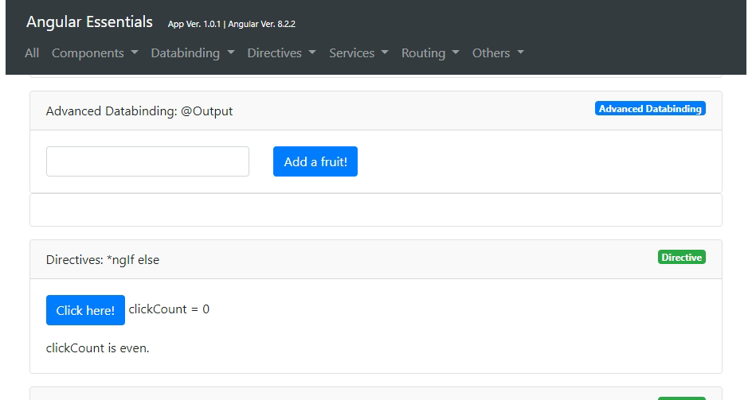

[Archived and won't be updated]

# Angular Essentials
> A fast way to review essential features of angular.

If you are new to angular, most probably you know it is easy to forget what you have learnt and you wish you had a simple project to review angular features fast. 

Angular Essentials is a simple tutorial/project that you can run and review angular features.

  

## Usage 

Angular Essentials is an angular project. So, make sure you have Node.js, NPM and Angular CLI installed. Then just clone (or download) the project and open it with your favorite IDE (e.g. vscode) and run it like any other angular project. Obviously you need to restore npm packages first.

```sh
npm install 
ng serve -o
```
